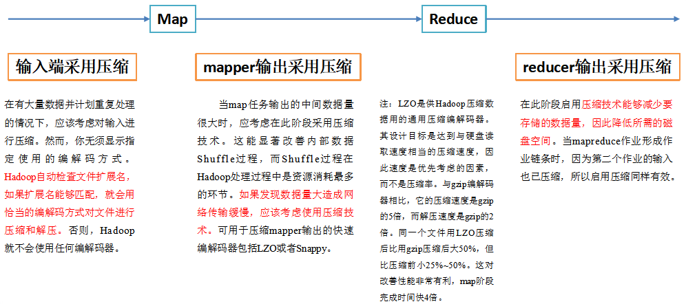

Hadoop——数据压缩
---
### 1、压缩概述
&emsp; 压缩技术能够有效减少底层存储系统（HDFS）读写字节数。压缩提高了网络带宽和磁盘空间的效率。在Hadoop下，尤其是**数据规模很大和工作负载密集的情况下，使用数据压缩显得非常重要**。在这种情况下，I/O操作和网络数据传输要花大量的时间。还有，Shuffle与Merge过程同样也面临着巨大的I/O压力。  
&emsp; 鉴于磁盘I/O和网络带宽是Hadoop的宝贵资源，**数据压缩对于节省资源、最小化磁盘I/O和网络传输非常有帮助**。不过，尽管压缩与解压操作的CPU开销不高，其性能的提升和资源的节省并非没有代价。  
&emsp; 如果磁盘I/O和网络带宽影响了MapReduce作业性能，在任意MapReduce阶段启用压缩都可以改善端到端处理时间并减少I/O和网络流量。  
&emsp; 压缩Mapreduce的一种优化策略：通过压缩编码对Mapper或者Reducer的输出进行压缩，以减少磁盘IO，提高MR程序运行速度（但相应增加了cpu运算负担）。  
&emsp; 注意：**采用压缩技术减少了磁盘IO，但同时增加了CPU运算负担。所以，压缩特性运用得当能提高性能，但运用不当也可能降低性能**。  
&emsp; 基本原则：   
&emsp; &emsp; （1）**运算密集型的job，少用压缩**  
&emsp; &emsp; （2）**IO密集型的job，多用压缩**  

### 2、MR支持的压缩编码

  

  
  
压缩性能的比较：

  

  
&emsp; On a single core of a Core i7 processor in 64-bit mode, **Snappy compresses at about 250 MB/sec** or more and **decompresses at about 500 MB/sec** or more.  

### 3、压缩方式选择
1）**Gzip压缩**  
&emsp; `优点`：压缩率比较高，而且压缩/解压速度也比较快；Hadoop本身支持，在应用中处理gzip格式的文件就和直接处理文本一样；大部分linux系统都自带gzip命令，使用方便。  
&emsp; `缺点`：不支持split。   
&emsp; `应用场景`：当每个文件压缩之后在130M以内的（1个块大小内），都可以考虑用gzip压缩格式。例如说一天或者一个小时的日志压缩成一个gzip文件，运行mapreduce程序的时候通过多个gzip文件达到并发。hive程序，streaming程序，和java写的mapreduce程序完全和文本处理一样，压缩之后原来的程序不需要做任何修改。  

2）**Bzip2压缩**  
&emsp; `优点`：支持split；具有很高的压缩率，比gzip压缩率都高；hadoop本身支持，但不支持native；在linux系统下自带bzip2命令，使用方便。  
&emsp; `缺点`：压缩/解压速度慢。  
&emsp; `应用场景`：适合对速度要求不高，但需要较高的压缩率的时候，可以作为mapreduce作业的输出格式；或者输出之后的数据比较大，处理之后的数据需要压缩存档减少磁盘空间并且以后数据用得比较少的情况；或者对单个很大的文本文件想压缩减少存储空间，同时又需要支持split，而且兼容之前的应用程序（即应用程序不需要修改）的情况。  

3）**Lzo压缩**  
&emsp; `优点`：压缩/解压速度也比较快，合理的压缩率；支持split，是hadoop中最流行的压缩格式；可以在linux系统下安装lzop命令，使用方便。   
&emsp; `缺点`：压缩率比gzip要低一些；hadoop本身不支持，需要安装；在应用中对lzo格式的文件需要做一些特殊处理（为了支持split需要建索引，还需要指定inputformat为lzo格式）。   
&emsp; `应用场景`：一个很大的文本文件，压缩之后还大于200M以上的可以考虑，而且单个文件越大，lzo优点越越明显。  

4）**Snappy压缩**  
&emsp; `优点`：高速压缩速度和合理的压缩率。   
&emsp; `缺点`：不支持split；压缩率比gzip要低；hadoop本身不支持，需要安装；   
&emsp; `应用场景`：当Mapreduce作业的Map输出的数据比较大的时候，作为Map到Reduce的中间数据的压缩格式；或者作为一个Mapreduce作业的输出和另外一个Mapreduce作业的输入。  

### 4、压缩位置选择

