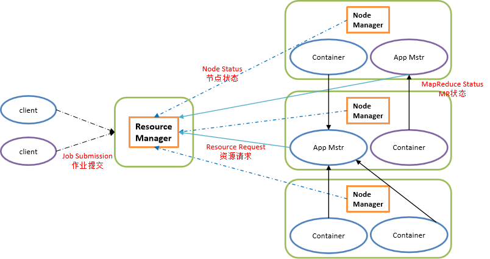
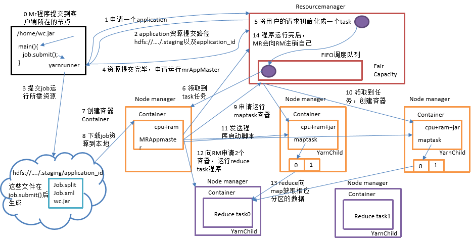
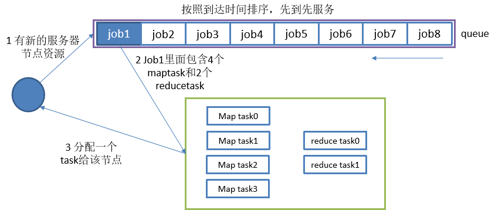

YARN
---
### 1、YARN概述
&emsp; Yarn是一个资源调度平台，负责为运算程序提供服务器运算资源，相当于一个分布式的操作系统平台，而MapReduce等运算程序则相当于运行于操作系统之上的应用程序。  

### 2、YARN基本架构
 

&emsp; YARN主要由**ResourceManager、NodeManager、ApplicationMaster和Container**等组件构成，如上图所示。

各组件主要作用：  
1）**ResourceManager（RM）**  
&emsp; ① 处理客户端请求  
&emsp; ② 监控NodeManager  
&emsp; ③ 启动或监控ApplicationMaster  
&emsp; ④ 资源的分配与调度  

2）**NodeManager（NM）**  
&emsp; ① 管理每个节点上的资源  
&emsp; ② 处理来自的ResourceManager的命令  
&emsp; ③ 处理来自ApplicationMaster的命令  

3）**ApplicationMaster（AM）**  
&emsp; ① 负责数据的切分  
&emsp; ② 为应用程序申请资源并分配给内部的任务  
&emsp; ③ 任务的监控与容错  

4）**Container**  
&emsp; Container是YARN中的资源抽象，它封装了某个节点上的多维度资源，如内存、CPU、磁盘、网络等。  

### 3、YARN工作机制


**工作机制详解**：  
（1）MR程序提交到客户端所在的节点。  
（2）YarnRunner向ResourceManager申请一个Application。   
（3）RM将该应用程序的资源路径返回给YarnRunner。   
（4）该程序将运行所需资源提交到HDFS上。   
（5）程序资源提交完毕后，申请运行mrAppMaster。   
（6）RM将用户的请求初始化成一个Task。   
（7）其中一个NodeManager领取到Task任务。   
（8）该NodeManager创建容器Container，并产生MRAppmaster。   
（9）Container从HDFS上拷贝资源到本地。   
（10）MRAppmaster向RM 申请运行MapTask资源。   
（11）RM将运行MapTask任务分配给另外两个NodeManager，另两个NodeManager分别领取任务并创建容器。   
（12）MR向两个接收到任务的NodeManager发送程序启动脚本，这两个NodeManager分别启动MapTask，MapTask对数据分区排序。   
（13）MrAppMaster等待所有MapTask运行完毕后，向RM申请容器，运行ReduceTask。   
（14）ReduceTask向MapTask获取相应分区的数据。   
（15）程序运行完毕后，MR会向RM申请注销自己。  

**YARN作业提交全过程**（流程图和工作机制一致）：  
（1）`作业提交`  
&emsp; 第1步：Client调用job.waitForCompletion方法，向整个集群提交MapReduce作业。   
&emsp; 第2步：Client向RM申请一个作业id。   
&emsp; 第3步：RM给Client返回该job资源的提交路径和作业id。   
&emsp; 第4步：Client提交jar包、切片信息和配置文件到指定的资源提交路径。   
&emsp; 第5步：Client提交完资源后，向RM申请运行MrAppMaster。   

（2）`作业初始化`   
&emsp; 第6步：当RM收到Client的请求后，将该job添加到容量调度器中。   
&emsp; 第7步：某一个空闲的NM领取到该Job。   
&emsp; 第8步：该NM创建Container，并产生MRAppmaster。   
&emsp; 第9步：下载Client提交的资源到本地。   

（3）`任务分配`   
&emsp; 第10步：MrAppMaster向RM申请运行多个MapTask任务资源。   
&emsp; 第11步：RM将运行MapTask任务分配给另外两个NodeManager，另两个NodeManager分别领取任务并创建容器。   

（4）`任务运行`  
&emsp; 第12步：MR向两个接收到任务的NodeManager发送程序启动脚本，这两个NodeManager分别启动MapTask，MapTask对数据分区排序。   
&emsp; 第13步：MrAppMaster等待所有MapTask运行完毕后，向RM申请容器，运行ReduceTask。   
&emsp; 第14步：ReduceTask向MapTask获取相应分区的数据。   
&emsp; 第15步：程序运行完毕后，MR会向RM申请注销自己。   

（5）`进度和状态更新`   
&emsp; YARN中的任务将其进度和状态(包括counter)返回给应用管理器, 客户端每秒(通过mapreduce.client.progressmonitor.pollinterval设置)向应用管理器请求进度更新, 展示给用户。   

（6）`作业完成`   
&emsp; 除了向应用管理器请求作业进度外, 客户端每5秒都会通过调用waitForCompletion()来检查作业是否完成。时间间隔可以通过mapreduce.client.completion.pollinterval来设置。作业完成之后, 应用管理器和Container会清理工作状态。作业的信息会被作业历史服务器存储以备之后用户核查。  

### 4、资源调度器
&emsp; 目前，Hadoop作业调度器主要有三种：FIFO、Capacity Scheduler和Fair Scheduler。Hadoop2.7.2默认的资源调度器是Capacity Scheduler。  
&emsp; 具体设置详见：yarn-default.xml文件  
```xml
<property>
    <description>The class to use as the resource scheduler.</description>
    <name>yarn.resourcemanager.scheduler.class</name>
    <value>org.apache.hadoop.yarn.server.resourcemanager.scheduler.capacity.**CapacityScheduler**</value>
</property>
```  

1）先进先出调度器（FIFO）  


2）容量调度器（Capacity Scheduler）  
 

（1）支持多个队列，每个队列可配置一定的资源量，每个队列采用FIFO调度策略。  
（2）为了防止同一个用户的作业独占队列中的资源，**该调度器会对同一用户提交的作业所占资源量进行限定**。  
（3）**首先，计算每个队列中正在运行的任务数与其应该分得的计算资源之间的比值，选择一个该比值最小的队列**。  
（4）**其次，按照作业优先级和提交时间顺序，同时考虑用户资源量限制和内存限制对队列内任务排序**。  
（5）三个队列同时按照任务的先后顺序依次执行，比如，job11、job21和job31分 别排在队列最前面，是最先运行，也是同时运行。  

3）公平调度器（Fair Scheduler）  


&emsp; **支持多队列多用户，每个队列中的资源量可以配置，同一队列中的作业公平共享队列中所有资源**。  
&emsp; 比如有三个队列: queueA、 queueB和queueC，**每个队列中的ob按照优先级分配资源，优先级越高分配的资源越多**，但是每个job都会分配到资源以确保公平。在资源有限的情况下，每个job理想情况下获得的计算资源与实际获得的计算资源存在一种差距，这个差距就叫做**缺额**。在同一一个队列中，**job的资源缺额越大，越先获得资源优先执行**。作业是按照缺额的高低来先后执行的，而且可以看到上图**有多个作业同时运行**。   


